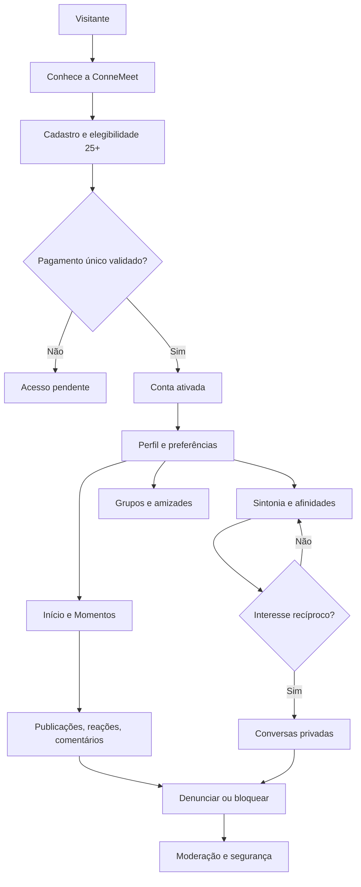

# ConneMeet — fluxos

```mermaid
flowchart TD
 A[Visitante] --> B[Conhece a ConneMeet]
 B --> C[Cadastro e elegibilidade 25+]
 C --> D{Pagamento único validado?}
 D -->|Não| E[Acesso pendente]
 D -->|Sim| F[Conta ativada]
 F --> G[Perfil e preferências]
 G --> H[Início e Momentos]
 G --> I[Sintonia e afinidades]
 G --> J[Grupos e amizades]
 H --> K[Publicações, reações, comentários]
 I --> L{Interesse recíproco?}
 L -->|Sim| M[Conversas privadas]
 L -->|Não| I
 K --> N[Denunciar ou bloquear]
 M --> N
 N --> O[Moderação e segurança]
```

**Nota:** fluxo planejado; o protótipo atual opera sem integração de cadastro, pagamento ou chat real.
